# AzureRose: The Workspace of the Impossible

> *"Clear vision to make the impossible possible."*

O **AzureRose** é um ambiente *all-in-one* de hiperprodutividade estudantil projetado para estudantes do ensino médio, vestibulandos e cursos universitários de alta exigência. Ele une a clareza espacial dos **Mapas Mentais ("O Olho")**, o poder do **Editor de Blocos com KaTeX**, e a proatividade de um **Motor de IA Flexível ("O Cérebro")**.

---

## Arquitetura do Sistema

```mermaid
flowchart LR
    subgraph Frontend ["Frontend (React + Tailwind + React Flow)"]
        Editor["Editor Rich-Text / KaTeX"]
        Olho["O Olho (Mapas Mentais / React Flow)"]
        SRS["Flashcards SRS (Repetição Espaçada)"]
        EmentaUI["O Teste da Ementa Difícil (Upload PDF)"]
        Pomo["Modo Hiperfoco (Pomodoro)"]
    end

    subgraph Backend ["Backend (FastAPI + SQLAlchemy)"]
        API["FastAPI REST & Async Pipelines"]
        DB[(PostgreSQL / SQLite + pgvector)]
    end

    subgraph AIEngine ["Camada de Abstração de IA (Factory)"]
        Mock["Mock Provider (Zero-config local)"]
        Gemini["Google Gemini (Contexto Longo de 2M tokens)"]
        OpenAI["OpenAI / DeepSeek / Groq"]
        LocalLLM["Modelo Próprio (Llama 3 / vLLM / Ollama)"]
    end

    Frontend <-->|HTTP / JSON| Backend
    Backend --> AIEngine
```



---

## Como Executar o Projeto

### 1. Inicializando o Backend (FastAPI)

```bash
cd backend
source venv/bin/activate
uvicorn app.main:app --reload --port 8000
```
- A API estará disponível em: `http://localhost:8000`
- Documentação interativa Swagger: `http://localhost:8000/docs`

### 2. Inicializando o Frontend (React + Vite)

```bash
cd frontend
npm run dev
```
- A aplicação estará rodando em: `http://localhost:3000`

---

## Flexibilidade de IA & Modelo Próprio

O AzureRose já conta com uma **arquitetura de IA agnóstica a provedor**. Você pode alternar no arquivo `backend/.env`:

```env
# Opções: "mock", "gemini", "openai_compatible", "local_vllm", "ollama"
AI_PROVIDER=mock

# Para usar o modelo do Google Gemini:
GEMINI_API_KEY=sua_chave_aqui
GEMINI_MODEL=gemini-2.0-flash

# Para usar o seu Modelo Próprio Fine-Tuned (ex: Llama 3 8B via vLLM / Ollama):
LOCAL_LLM_URL=http://localhost:11434/v1
LOCAL_LLM_MODEL=azurerose-llama3-8b
```

---

## Testes Automatizados

O backend possui uma suíte de testes assíncrona cobrindo todas as rotas e pipelines:

```bash
cd backend
PYTHONPATH=. venv/bin/pytest -v tests
```
